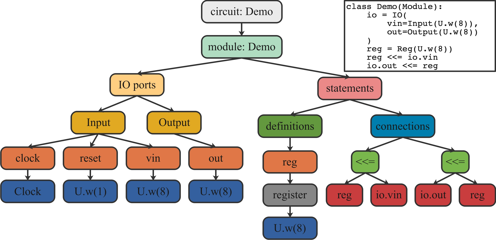

# Bus Slave Factory Implementation
## Introduction
## Specification
## Implementation
### BusSlaveFactory
### BusSlaveFactoryDelayed
### AvalonMMSlaveFactory
## Conclusion


# How to HACK this documentation
## Title convention
## Wavedrom integration
## New section
### example


# SpinalHDL internal datamodel
## Introduction
## General structure
## Exploring the datamodel
## Compilation Phases
## Modifying a netlist as a user without plugins
## User space netlist analysis
## Enumerating every ClockDomain used


# Types
## Introduction
- Supports multiple data types: `UInt`, `SInt`, `Vector`, `Bundle`, `Clock`, `Memory`, and casual combination between them.
- Supports object-oriented inheritance, can compose modules by writing fewer codes.
- Supports a bunch of convenient operations, such as the addition of `UInt`s, `SInt`s, `Vector`s and `Bundle`s.
- Supports the parameterization of variables, such as bit width, with the syntax facilities of the host language Python.
  
- Base types : `Bool`, `U`, `Clock` for unsigned integers, `S` for signed integers.
- Composite types : `Bundle`, `Vec`.
  

Those types and their usage (with examples) are explained hereafter.

About the fixed point is not supported.

- `U`	    Unsigned integer
- `S`	    Signed integer
- `Bool`	Boolean type, implemented as 1-bit unsigned integer
- `Clock`	Implicit built-in data type represents the clock of a module
- `Vec`	    Create an indexable vector consists of elements in same data type
- `Bundle`	Create a set consists of elements in different data types


## Bool

* `Bool`: bool value，which is `U(1.w)`
* `True,False`: boolean literals

|        Syntax        |                             Description                              |    Return     |
|:--------------------:|:--------------------------------------------------------------------:|:-------------:|
|         Bool         |                            Create a Bool                             |    U.w(1)     |
| Bool(value: Boolean) | Create a Bool <br/>assigned with a Python Boolean<br/> (true, false) | U.w(1)(value) |

```python
myBool_1 = Bool         # Create a Bool
myBool_1 = Bool(True)
myBOol_2 = Bool(3>5)    # same as Bool(False)
io.cout @= myBool_1     # @= is the assignment operator
```


## The BitVector family - (Bits, UInt, SInt)
## Bits
## UInt,SInt

|                      Syntax                       |                             Description                              |    Return    |
|:-------------------------------------------------:|:--------------------------------------------------------------------:|:------------:|
|           U(value:Int)<br/>S(value:Int)           |     Create an unsigned/signed <br/>integer assigned with ‘value’     |   U<br/>S    |
|            U.w(x bits)<br/>S.w(x bits)            |          Create an unsigned/signed <br/>integer with x bits          |   U<br/>S    |
| U.w(x bits)(value:Int)<br/>S.w(x bits)(value:Int) | Create an unsigned/signed <br/>integer assigned with ‘value’, x bits |   U<br/>S    |

```python
U(1)	# 1-bit unsigend decimal value 1
U(0x126) # 12-bit unsigned hexadecimal value 0x126
U.w(4)(10) # 4-bit unsigned decimal value 10
S.w(16)(0x11) # 16-bit signed hexadecimal value 0x11
```

|  Operator  |              Description              |
|:----------:|:-------------------------------------:|
|   x ^ y    |              Bitwise XOR              |
|     ~x     |              Bitwise NOT              |
|   x & y    |              Bitwise AND              |
|  x &#124; y   |              Bitwise OR               |
|   x >> y   | 	Logical(U)/Arithmetic(S) shift right |
|   x << y   |          	Logical shift left          |
|   x + y    |          Arithmetic addition          |
|   x - y    |        Arithmetic subtraction         |
|   x * y    |       Arithmetic multiplication       |
|   x / y    |          Arithmetic division          |
|   x % y    |          Arithmetic modules           |
|    - x     |          Arithmetic negative          |
|   x == y   |               Equality                |  
|   x != y   |              Inequality               |
|   x > y    |             Greater than              |
|   x >= y   |         Greater than or equal         |
|   x < y    |              	Less than               |
|   x <= y   |          	Less than or equal          |


## Bool,Bits,UInt,SInt
`cast function`
## Vec

```python
Vec(<size>, <cdatatype>)
```
```python
rarray = Wire(Vec(4, U.w(16)))	# A 16-bit 4 length unsigned integer wire array
for i in range(0, 4):
  rarray[i] <<= U(i)
```

## Bundle
### Simple example(RGB/VGA)
### Interface example(APB)
## Enum
## Data(Bool,Bits,UInt,SInt,Enum,Bundle,Vec)
## Literals as signal declaration